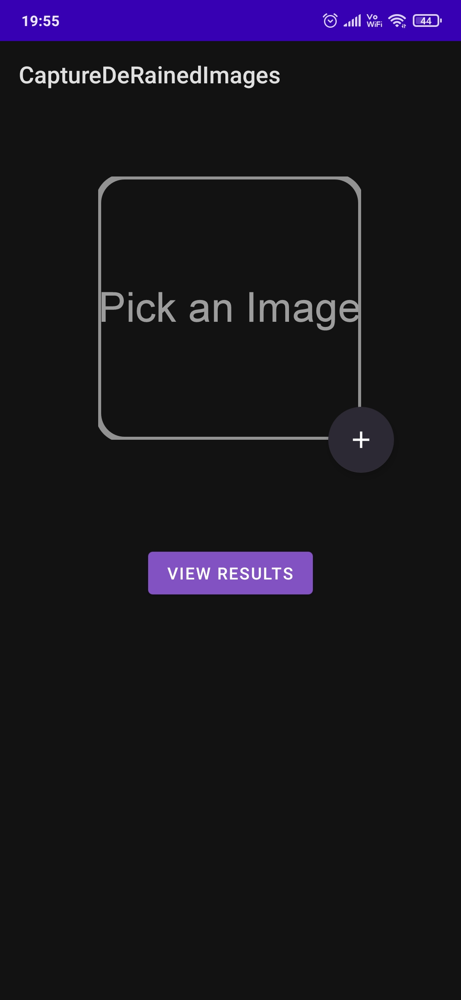
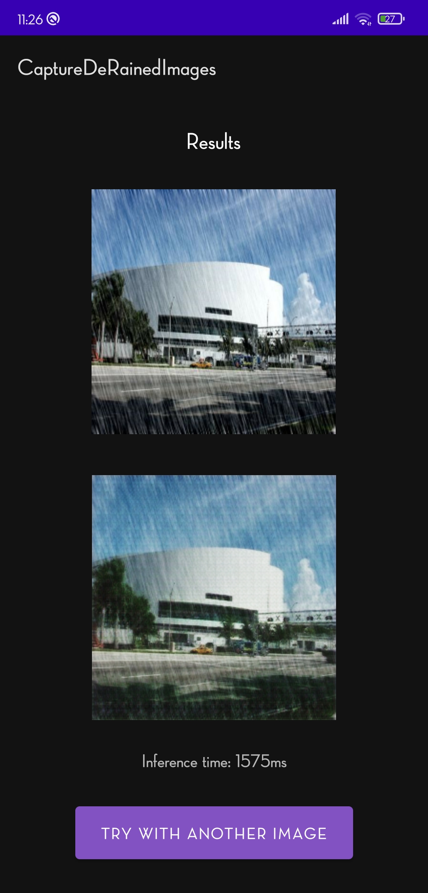

# Image DeRaining Android App

This is an Android sample app with the pix2pix GAN TensorFlow Lite model for removing rain-streaks from rainy images.

## NoteBook
Refer Notebook folder for pix2pix GAN model  source code - [paper](https://arxiv.org/abs/1611.07004).

Dataset used [Link](https://drive.google.com/drive/u/0/folders/1_ajcxP_UplNbpMsBgM6fuHmH4Min5lF0).

## TensorFlow Lite Model
There is one TensorFlow Lite Models included [Link](https://drive.google.com/drive/folders/1X5uYkbwSP4HxFCSrE1qEF_cUD8etBTDw?usp=sharing) (Refer README for details).  
Android Studio ML Model Binding was used to import these models into the Android project.

## Requirements
* Android Studio Preview Beta version - download [here](https://developer.android.com/studio/preview).
* Android device  in developer mode with USB debugging enabled
* USB cable to connect an Android device to computer

## Build and run
* Clone the project repo:  
`git clone https://github.com/Abhi03-ag/Image-DeRaining-App.git`  
* Open the Android code android/CaptureDeRainedImages in android Studio.
* Download the TFLite model from the google drive link mentioned above.
* Create a new asset folder named ml in app/src/main and add the tflite model there.
* Connect your Android device to computer then click on `"Run -> Run 'app'`.
* Once the app is launched on device, grant camera permission.
* Use the App

## App Screenshot

  
 **HomeScreen**            |  **ResultScreen**
:-------------------------:|:-------------------------:
  
  

  
   
  

